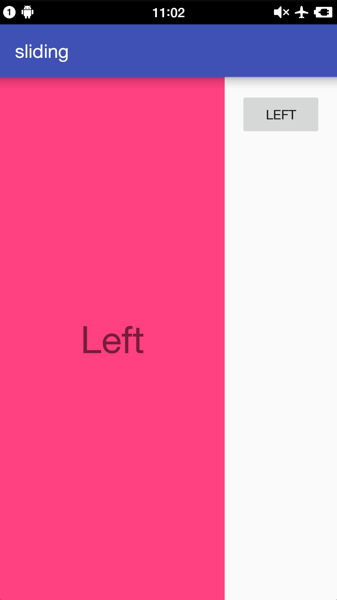
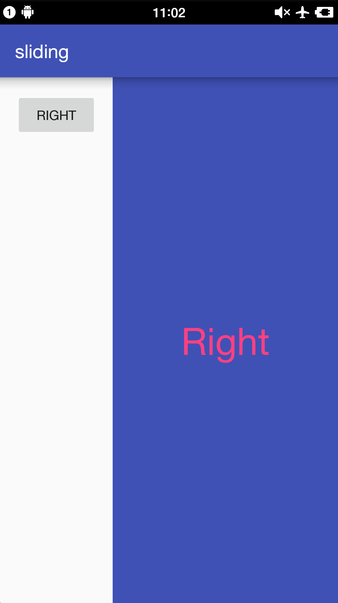

#SlidingMenu
###An Android library that allows you to easily create applications with slide-in menus.


###Add the dependency
##### step 1
```gradle
allprojects {
	repositories {
		...
		maven { url "https://www.jitpack.io" }
	}
}
```
##### step 2
```gradle
compile 'com.github.yunTerry:SlidingMenu:3.0.0'
```

###Add SlidingMenu
```java
SlidingMenu slidingleft = new SlidingMenu(this);
slidingleft.setMenu(R.layout.slidingleft);
slidingleft.setMode(SlidingMenu.LEFT);
slidingleft.setTouchModeAbove(SlidingMenu.TOUCHMODE_FULLSCREEN);
slidingleft.setBehindOffsetRes(R.dimen.slidingmenu_offset);
slidingleft.setFadeDegree(0.35f);
slidingleft.attachToActivity(this, SlidingMenu.SLIDING_CONTENT);
```

Developed By
------------
* Jeremy Feinstein

License
-------

    Copyright 2012-2014 Jeremy Feinstein

    Licensed under the Apache License, Version 2.0 (the "License");
    you may not use this file except in compliance with the License.
    You may obtain a copy of the License at

    http://www.apache.org/licenses/LICENSE-2.0

    Unless required by applicable law or agreed to in writing, software
    distributed under the License is distributed on an "AS IS" BASIS,
    WITHOUT WARRANTIES OR CONDITIONS OF ANY KIND, either express or implied.
    See the License for the specific language governing permissions and
    limitations under the License.